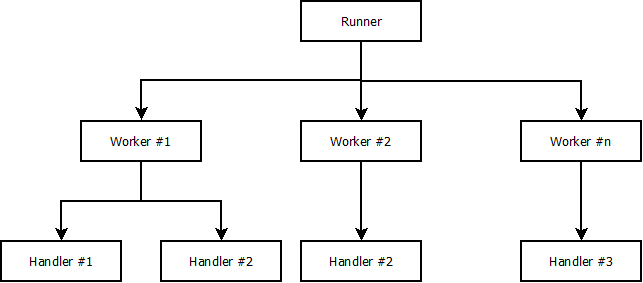

Beanstalkd workers
==================

This library is inspired by [fivebeans](https://github.com/ceejbot/fivebeans) which uses a worker model with handlers
but promises are used and multiple workers can be used of only strictly one.

A handler processes jobs which a worker gives them, themselves handled by a runner.



How to write handlers
---------------------

Handlers need to extend `AbstractHandler` and override `constructor()` as well as `process()`. We'll write a no-op
handler which reserves jobs and deletes them without doing anything particular.

Dependencies can be set up using the `initialize()` method.

```javascript
const AbstractHandler = require('../src/AbstractHandler');

class NoopHandler extends AbstractHandler {
    /**
     * Initializes a noop handler.
     *
     * @param {Object} configuration The handler's configuration.
     * @param {Logger} logger A logger.
     */
    constructor(configuration, logger) {
        super(
            '*',           // Job type
            configuration, // Handler's configuration
            null,          // Handler's configuration's schema
            null,          // Payloads' schema
            logger         // Logger
        );
    }

    /**
     * Sets up a handler's dependencies.
     *
     * This method can be used to set up dependencies that might be asynchronous.
     *
     * @return {Promise<void,*>} Resolved when initialized.
     */
    initialize() {
        return Promise.resolve();
    }

    /**
     * Processes a job.
     *
     * @param {*} payload The job's payload.
     * @param {String} id The job's id.
     * @param {String} type The job's type.
     */
    process(payload, id, type) {
        this.logger.debug('Job #' + id + ' - ' + type, payload);

        return Promise.resolve('delete');
    }
}
```

### `constructor(configuration, logger)`

Handlers are built with two parameters: their configuration and a logger. By default, configuration is an empty object
which can be filled when initializing the runner as we'll see later.

Handlers need to call their parent's constructor to complete the set-up:

* `type` is a unique string which represents which type of jobs the handler will process, or `'*'` it should handle
  every one of them. `'*'` has a lower priority than a named type.
* `configuration` is the handler's configuration as said before.
* `configurationSchema` is the handler's configuration's schema to validate the configuration.
* `payloadSchema` is the jobs' payload's schema to automatically validate their contents before being processed: when a
  payload is invalid, the job will automatically be buried.
* `logger` is the logger given to the runner.

### `process(payload, id, type)`

Handlers' `process(payload, id, type)` method need to return a `Promise` which will tell workers what they need to do
with jobs after being handled:

* `Promise.resolve('delete')` if the job is completed and needs nothing more.
* `Promise.resolve(['release', {priority, delay}])` if the job needs to be handled again, for example after an error.
  `priority` and `delay` are both optional.
* `Promise.resolve('bury')` if the job needs to be buried.

If an action isn't recognized, job will be buried by default.

### `initialize()`

Should your handler need further initialization, especially asynchronously, it can be done in the `initialize()` method
which is called **before** any jobs processing. For example, a database client can be set up and connected to be used
later.

References
----------

* [beanstalkd](https://beanstalkd.github.io/)
* [Jackd](https://github.com/getjackd/jackd), beanstalkd client
* [ESLint](https://eslint.org/), static analysis
* [Mocha](https://mochajs.org/), test framework
* [Chai](https://www.chaijs.com/), assertion library
* [test-console](https://github.com/jamesshore/test-console), library to test console.log and console.error
* [JSON Schema](https://json-schema.org/), JSON schemas specification
* [jsonschema](https://github.com/tdegrunt/jsonschema), JSON Schema implementation

To-do list
----------

* Write more documentation
* Test ValidationError
* Test Worker
* Test Runner
